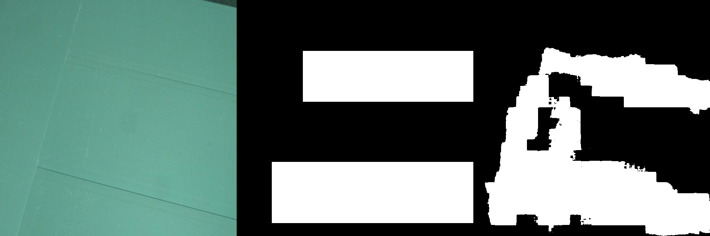
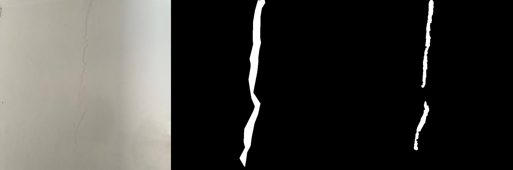

# Prompted Segmentation for Drywall QA

**Automated Quality Assurance for Drywall Installation using Text-Conditioned Segmentation (CLIPSeg).**

## Goal
The objective of this project is to fine-tune a text-conditioned segmentation model to identify specific defects and features in drywall images. Given an image and a natural language prompt, the model generates a binary mask highlighting the target area.

**Task:**
1.  **"segment crack"**: Detect structural damage (cracks).
2.  **"segment taping area"**: Identify drywall joints and taping seams.

## Data Preparation - Preprocessing (COCO to Mask)
The source datasets were originally in **COCO Object Detection format** (JSON coordinates). To adapt this for semantic segmentation, a custom preprocessing script was implemented to convert vector annotations into pixel-wise binary masks:

- **Conversion Logic:** The script parses the JSON annotations and "draws" them onto a blank canvas.
- **Precision Priority:** It prioritizes precise **segmentation polygons** to capture irregular shapes (like cracks). If polygon data is missing, it falls back to filling the **bounding box**.
- **Output:** The result is a **binary PNG mask** (single-channel) for every image, where `0` represents the background and `255` represents the target feature, matching the input requirements for CLIPSeg.

## Data Split & Integrity
The source datasets had differing directory structures: the Cracks dataset provided full Train/Valid/Test splits, while the Drywall Join dataset provided only Train/Valid splits. To ensure rigorous evaluation and prevent data leakage, the model was fine-tuned exclusively on the train partition of both datasets. For the final performance evaluation, we utilized the dedicated test set for the Cracks task. For the Drywall Join task, we utilized the held-out valid set as the testing proxy, ensuring that no images used for gradient updates (backpropagation) were ever used for scoring

## Approach / Model tried
We utilized **CLIPSeg (CLIP-based Image Segmentation)**, a model capable of zero-shot and fine-tuned segmentation based on arbitrary text prompts.

- **Model:** `CIDAS/clipseg-rd64-refined` (from Hugging Face)
- **Technique:** Frozen CLIP Encoder + Fine-tuned Decoder.
- **Optimization:** Binary Cross Entropy Loss (BCE) with AdamW optimizer.
- **Resolution:** Inputs resized to 352x352 for processing, then upscaled to original resolution for evaluation.

## Methodology
We utilized CLIPSeg (CLIP-based Image Segmentation), a model capable of generating segmentation masks based on arbitrary text prompts.
- Architecture: We froze the pre-trained CLIP encoder (to leverage its zero-shot capabilities and reduce training cost) and only fine-tuned the lightweight decoder.
- Training Strategy: The model was trained for 10 epochs using a combined dataset. We injected the prompt "segment crack" for images from the cracks dataset and "segment taping area" for the drywall join dataset, allowing a single model to handle both tasks via prompt conditioning.
- Loss Function: Binary Cross Entropy with Logits Loss (BCEWithLogitsLoss).
- Optimizer: AdamW with a learning rate of 1e-4.

## Dataset
The model was trained on a combined dataset sourced from Roboflow:
1.  **[Drywall Join Detect](https://universe.roboflow.com/objectdetect-pu6rn/drywall-join-detect):** Mapped to prompt *"segment taping area"*.
2.  **[Cracks Dataset](https://universe.roboflow.com/fyp-ny1jt/cracks-3ii36):** Mapped to prompt *"segment crack"*.

**Data Split:**
* **Training:** Mixed batches from both datasets.
* **Test:** ~254 images total (250 Taping from Dataset 1 / 4 Cracks from Dataset 2).

## Installation
1.  **Install dependencies:**
    ```
    pip install torch torchvision transformers pillow opencv-python tqdm tensorboard
    ```

3.  **Data Setup:**
    Ensure your data is extracted into a folder named `Prompt_Segmentation/` with the following structure:
    ```text
    Prompt_Segmentation/
    ├── cracks-1/
    │   ├── train/
    │   ├── valid/
    │   └── test/
    └── Drywall-Join-Detect-1/
        ├── train/
        ├── valid/
        └── test/
    ```

## Usage

### 1. Training
- To fine-tune the model GPU: python training.py
- Logs metrics to TensorBoard (runs/)

### 2. Evaluation
- To generate predictions and calculate mIoU and Dice scores: python evaluate.py
- Masks generated in a test/train/valid folder of datasets (Prompt_Segmentation/)
- Saves visualisation comparison in (report_examples/)

### 3. Results

| Prompt | mIoU | Dice Score |
| :--- | :--- | :--- |
| **"segment taping area"** | 0.5223 | 0.6706 |
| **"segment crack"** | 0.3280 | 0.4863 |

- Note: The lower scores are expected due to the resolution constraints of the model (352x352), which makes pixel-thin cracks appear wider in the prediction mask than in the ground truth.

### 3.1 Visual Qualitative Analysis (report_examples/)
Below are representative examples comparing the Original Image, Ground Truth (Manual Annotation), and the Model Prediction.

- An example of segment taping area
  


- An example of segment crack


- An example of segment crack
- 


### 4. Computational footprints
- Training Time: 88.10 minutes (10 epochs on GPU).
- Hardware used: NVIDIA RTX Ada.
- Inference Speed: 65.35 ms/image.
- Model Size: 575.11 MB.
- Weights Size: 603.0 MB.
- Reproducibility: Seed fixed at 42.
- Libraries: PyTorch, NumPy, Python random.


## Discussion & Failure Analysis

- Resolution Constraints: Qualitative analysis reveals that while the model correctly identifies the location of defects (high recall), the segmentation masks often lack fine-grained boundary precision (ie lower IoU). This is attributed to the architectural limitation of "CLIPSeg", which processes inputs at a fixed resolution of 352x352.
- Impact on Cracks: Cracks are often 1–3 pixels wide in the original 4K images. When downsampled to 352p, these features blur. The model's prediction, when upscaled back to original resolution, appears "blobby" or wider than the target. This heavily penalizes the mIoU score for cracks (0.328) despite correct localization.
- Impact on Taping: Taping areas are wider features, making them more resilient to this resolution loss, resulting in a significantly higher mIoU (0.522).
- Conclusion: Despite the resolution bottleneck, the model successfully learned semantic distinction between "cracks" and "taping areas" using natural language prompts, achieving the goal of a multi-task QA system.
